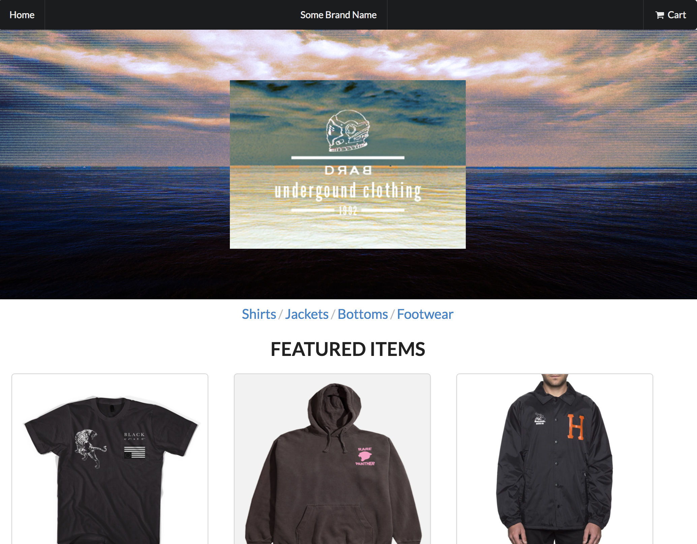
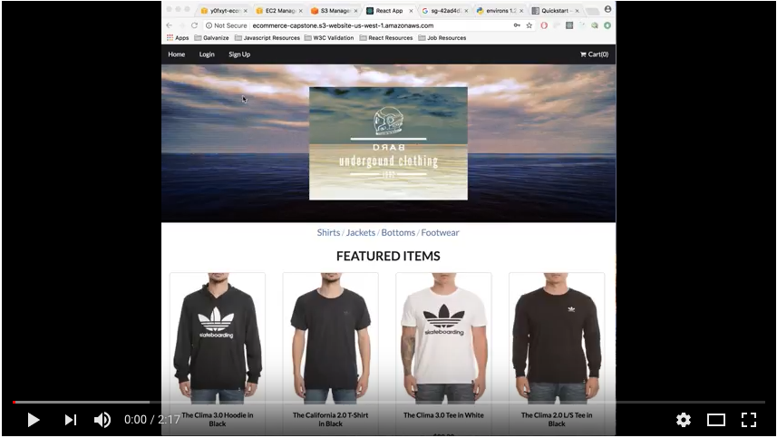

# React E-Commerce Site

## Fully Functional CRUD Application

The site displays clothing products and information pulled from an PostgreSQL database. Currently you can click category tabs to display different items based on category and add them to the cart. There is a favorites option for keeping track of items you like. This information is stored on the profile page. You can mock checkout where the your order and items you ordered will be stored on the profile page as well. There is also an admin page for creating/updating/deleting products.

## Demo Video

### Future Enhancements

- Make checkout system more realistic.
- Polishing CSS for even cleaner look.
- Adding more categories i.e. hats or accessories.
- Implement search bar for items on main page.
- Add filtering by brand.Â
